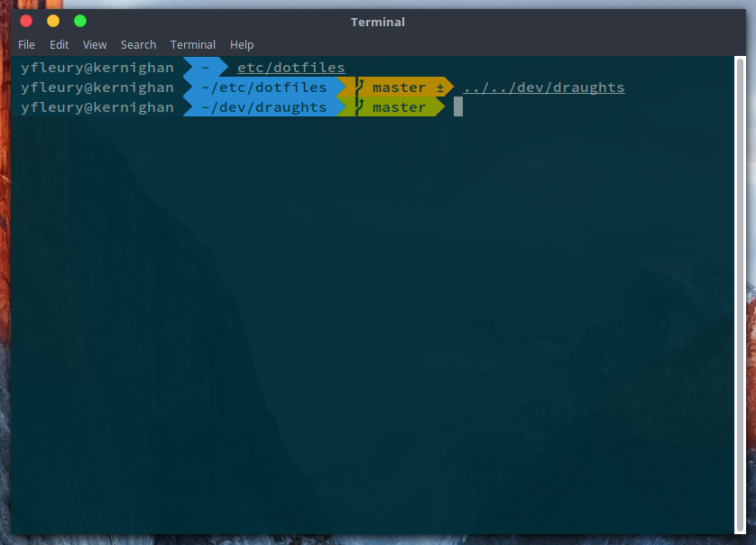

# DOTFILES

## Purpose

Config files used by many softwares on UNIX systems. Use at your own risk.

* git
* vim
* zsh

## Feedbacks

Suggestions and improvements are welcome on the [issue panel](https://github.com/yoannfleurydev/dotfiles/issues/new) !
