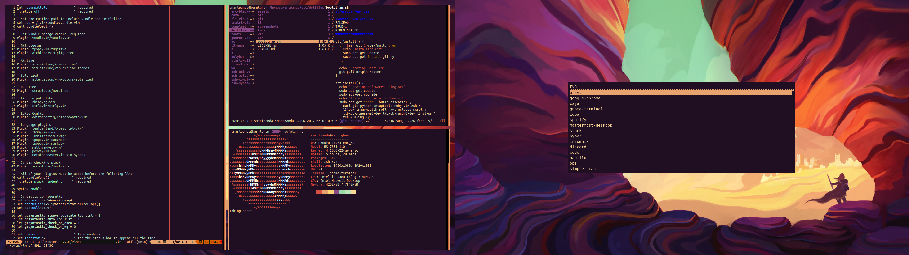
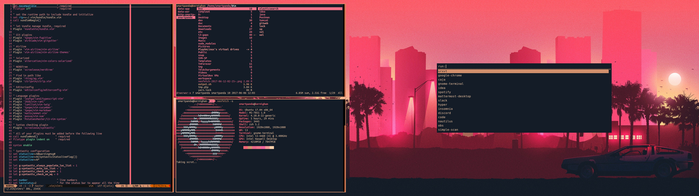
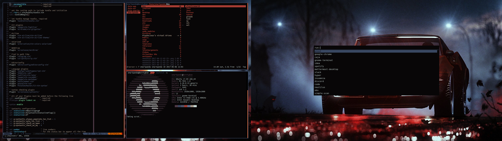
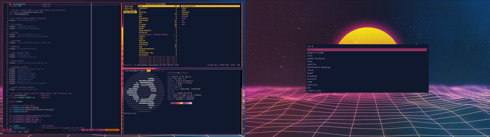
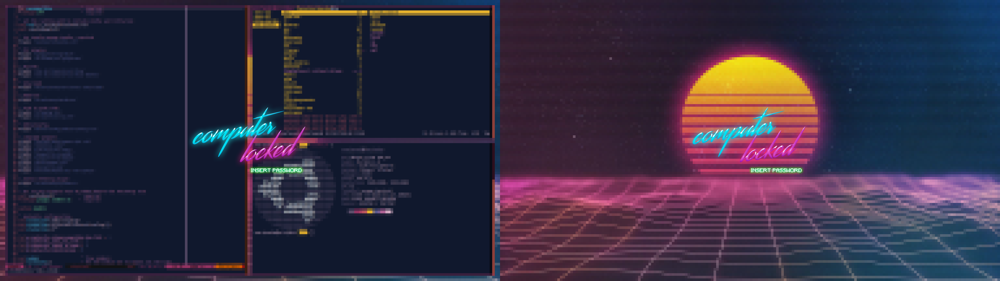

# DOTFILES

**WM**

I3 (gaps) is my Window Manager. I'm fond of this little gaps between windows. I
use [pywal](https://github.com/dylanaraps/pywal) script to change the wallpaper
and the colorscheme of my softwares, like `termite`, `i3` or `rofi`.

**Terminal**

I use ZSH with agnoster prompt (with powerline patched font). I have customized
the prompt to show if the last commit is a Work in Progress or not.

**Lockscreen**

I use i3lock for the lockscreen. I have a custom script to enable multi-monitor
lockscreen. You can check [the script](./scripts/lock) in this repository.

## Purpose

Configuration files used by many softwares on UNIX systems. Use at your own
risk.

* editorconfig
* git
* i3
* tmux
* vim
* zsh

## Requirements

Set zsh as your login shell :

`chsh -s $(which zsh)`

Be sure to have the following :
* A basic shell to run the scripts.
* A patched [Nerd Font](https://github.com/ryanoasis/nerd-fonts) for devicons in
  Vim

## Command Line Interface softwares

* [the\_silver\_searcher](https://github.com/ggreer/the_silver_searcher) -
  similar to ack but faster
* [tig](https://github.com/jonas/tig) - text mode interface for git
* [ranger](https://github.com/ranger/ranger) - a VIM-inspired file manager
* [k](https://github.com/supercrabtree/k) - ls alternative
* [mycli](https://github.com/dbcli/mycli) - cli mysql client written in python
* [gitmoji-cli](https://github.com/carloscuesta/gitmoji-cli) - a gitmoji
  interactive client for using emojis on commits.
* [z](https://github.com/rupa/z) - tracks your most used directories, based on
  'frecency'.
* [pywal](https://github.com/dylanaraps/pywal) - 🎨 Generate and change
  colorschemes on the fly. A 'wal' rewrite in Python 3.

## Scripts

* **lock** : used as a lockscreen
* **vol** : manage the volume
* **gitweb** : open the remote repository web interface
* **sp** : control spotify in command line interface

## Feedbacks

Suggestions and improvements are welcome on the
[issue panel](https://github.com/yoannfleurydev/dotfiles/issues/new) !

