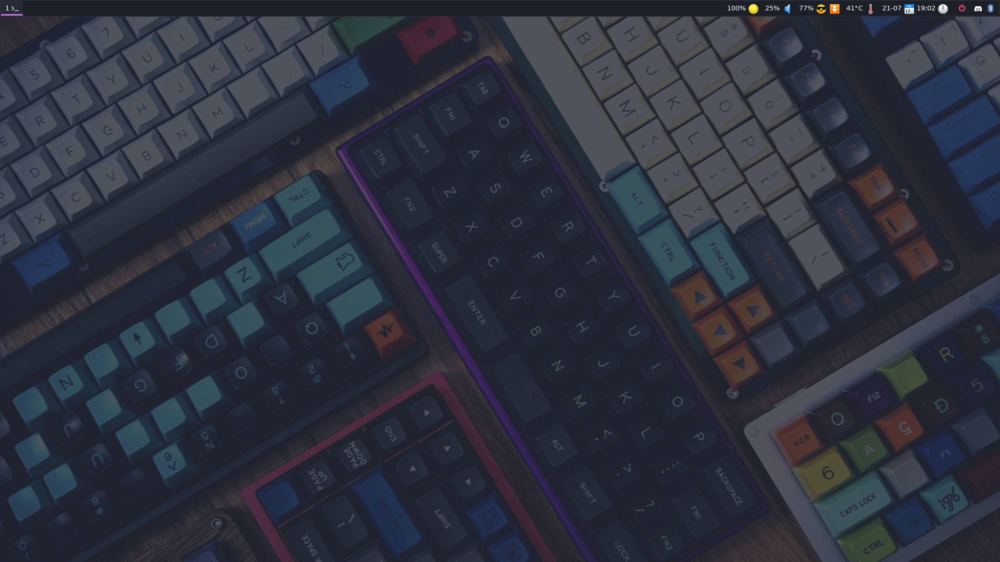
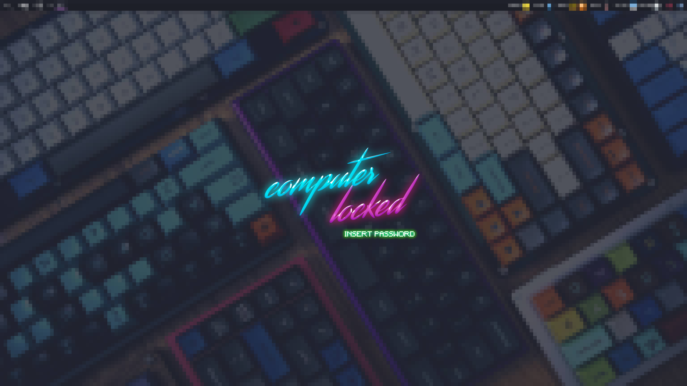

# DOTFILES

**WM**

[i3-gaps](https://github.com/Airblader/i3) is my Window Manager.

**Terminal**

[Alacritty](https://github.com/alacritty/alacritty) is my main terminal, it is
written in Rust and is very fast. As a shell, I use
[fish](https://github.com/fish-shell/fish-shell), that I find fast too and that
has great default integrations. The prompt I use is
[starship](https://starship.rs/).

**Lockscreen**

I use [i3lock](https://github.com/i3/i3lock) for the lockscreen. I have a custom script to enable multi-monitor
lockscreen. You can check [the script](./scripts/lock) in this repository.

## Purpose

Configuration files used by many softwares on UNIX systems. Use at your own
risk.

- alacritty (terminal configuration)
- cava (terminal visualizer)
- compton
- editorconfig
- espanso (cross platform text expander)
- fish (shell)
- git (code versionning)
- i3 (windows manager)
- morc-menu
- polybar (topbar)
- rofi (launcher)
- tmux (terminal multiplexer)
- vim (terminal editor)

## Requirements

Set fish as your login shell :

`chsh -s $(which fish)`

- `arandr` installed to generate your `~/.screenlayout` scripts that will be
  prompted by i3wm on <kbd>MOD</kbd>+<kbd>x</kbd>

## Command Line Interface softwares

- [gitweb](https://github.com/yoannfleurydev/gitweb) - Open the current remote repository in your browser
- [bat](https://github.com/sharkdp/bat) - A cat(1) clone with wings. 
- [the\_silver\_searcher](https://github.com/ggreer/the_silver_searcher) -
  similar to ack but faster
- [tig](https://github.com/jonas/tig) - text mode interface for git
- [ranger](https://github.com/ranger/ranger) - a VIM-inspired file manager
- [fzf](https://github.com/junegunn/fzf) - 🌸 A command-line fuzzy finder
- [fpp](https://github.com/facebook/PathPicker) - Facebook Path Picker
- [ctags](http://ctags.sourceforge.net/) - Generate an indexof names found in
  source and header files of various programming language. Useful for tags
  feature in Vim.
- [xclip](https://github.com/astrand/xclip) - Command line interface to the X11
  clipboard

## Scripts

- **lock** : use i3lock and custom logic to lock the computer screen
- **vol** : controle the volume in command line
- **sp** : control spotify in command line interface useful to use with i3 keys
  mapping.

## Feedbacks

Suggestions and improvements are welcome on the
[issue panel](https://github.com/yoannfleurydev/dotfiles/issues/new) !
